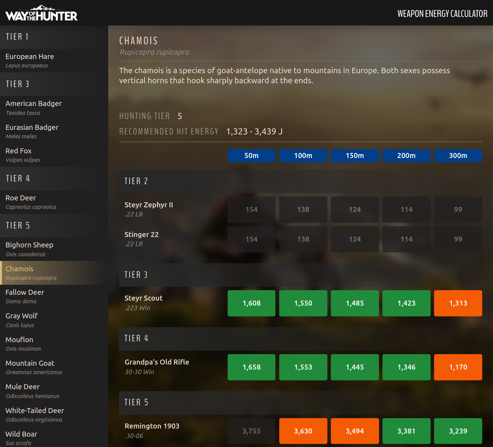

# Way Of The Hunter Weapon Energy Calculator

## About

This interactive web application helps you choose the most appropriate weapons
when hunting animals in the [Way Of The Hunter](https://www.wayofthehunter.com)
game by highlighting those that fall within the recommended hit energy range (
RHE) for each animal.

## Usage

To start choose an animal that you are planning on hunting from the sidebar on
the left. Once an animal is selected the right side of the page will be
populated with information about the animal such as its English and Latin names,
a short description, its tier and the recommended hit energy (RHE)
in [joules](https://en.wikipedia.org/wiki/Joule) that should be used when
hunting it.

Under this information you will find a table listing all available rifles and
their hit energy ratings at various distances in meters (50, 100, 150, 200 and
300).

*Refer to the instructions below on how to read values displayed in this table.*

## Reading results

Values highlighted in **green** indicate the most optimal (ethical) hit energy
values for the currently selected animal at the respective distance.

Values highlighted in **orange** indicate hit energy values that fall within 10%
of the RHE range (i.e. values that are suboptimal but still mostly applicable to
the currently selected animal).

RHE range is the difference between the minimum RHE value and the maximum one.
E.g. for chamois (also shown in the screenshot above) the RHE is between 1,323
and 3,439 joules, which means that the range is 2,116 joules (3,439 - 1,323 =
2,116).

10% of this value is 212 (due to rounding up or down to the nearest whole
number). That means that anything that is...

- between 1,111 (1,323 - 212) and 1,323
- OR
- between 3,439 and 3,651 (3,439 + 212)

...will be highlighted in orange and considered to be a suboptimal hit energy (
yet still acceptable).

All other values that are neither optimal nor suboptimal will be grayed out to
indicate that they are not ethical for the current animal at those distances.

*Names of weapons that are ethical at ALL listed distances will be highlighted
to make it easier to find them at a glance.*

## Example

Let's take fallow deer as an example.

To find weapons that are the most ethical when hunting these animals up to 300
meters first select "Fallow Deer" from the sidebar on the left. Once done so,
you will see that the recommended hit energy values are between 1,462 and 3,510
joules.

By looking through the list of weapons you will notice that none of the weapons
in tier 2 are applicable as all their values are grayed out due to having
insufficient hit energy at all distances.

Steyr Scout in tier 3, however, is perfectly usable up to 150 meters, albeit the
values are rather close to the lower end of the RHE range. Values at 200 and 300
meters are just outside the recommended hit energy for fallow deer but should
still yield a successful harvest granted you land a hit on vital organs.

Going further down in the list you will see that Grandpa's Old Rifle is similar
in its hit energy to Steyr Scout but is slightly weaker and no longer optimal at
150 meters. Still usable at 0-100 meters though.

Now, tier 5, being the same tier as the animal itself (as displayed at the top
of the page), expectedly contains quite a few rifles that we can use. You can
see that four weapons are fully optimal at all ranges (Remington 783, Steyr
Monoblock, Steyr Pro Hunter and Steyr Pro Hunter II) and are perfect for hunting
fallow deer. Remington 1903 is a complete overkill up to 50 meters but is mostly
alright at 100 meters. Distances further than that are optimal.

Finally, as you can see none of the tier 6 weapons should be used for hunting
fallow deer as their hit energy values far exceed the recommended ones.
Remington 673 Guide Rifle could be used at 300 meters but is unethical at
anything less than that, which makes it a bad choice.

## Notes

This application was primarily designed to be used on desktop browsers. It is,
however, a responsive web application, which means that the layout and page
elements are dynamically adapted and resized to fit on all screens. As a result
the application also works perfectly well on tablets, which is my personal
choice when using it.
