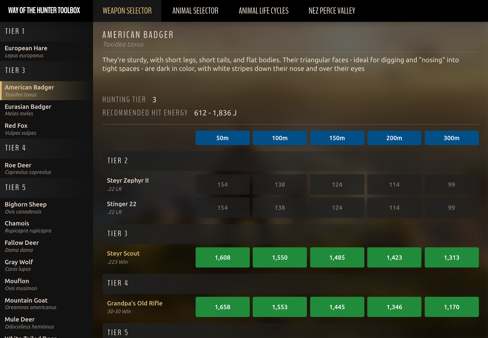
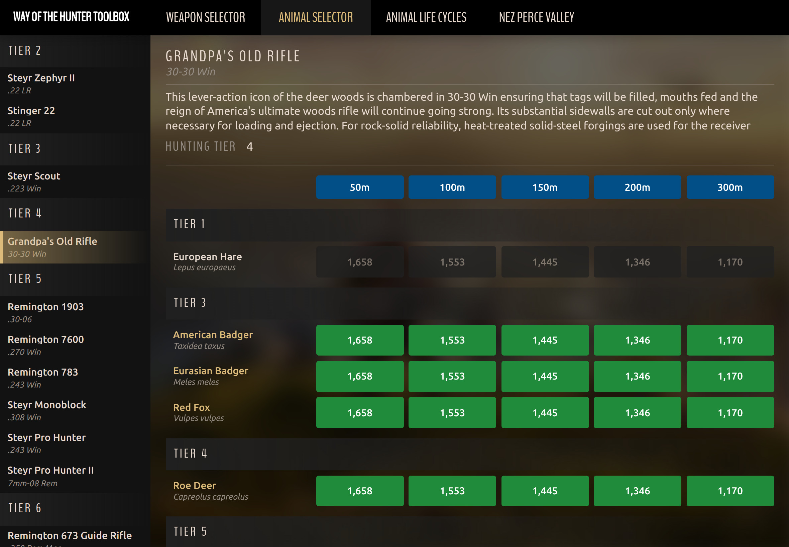
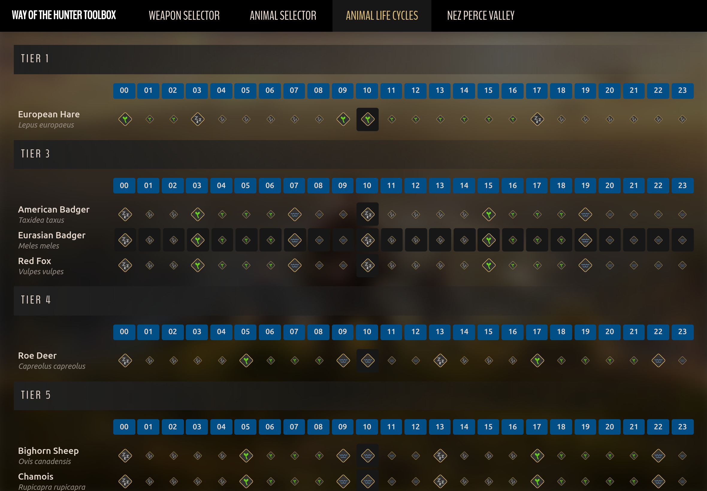
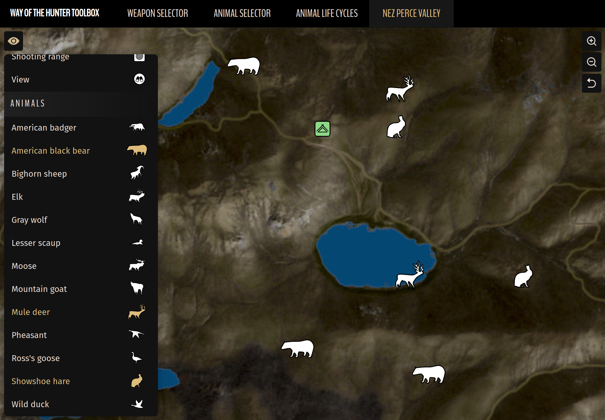
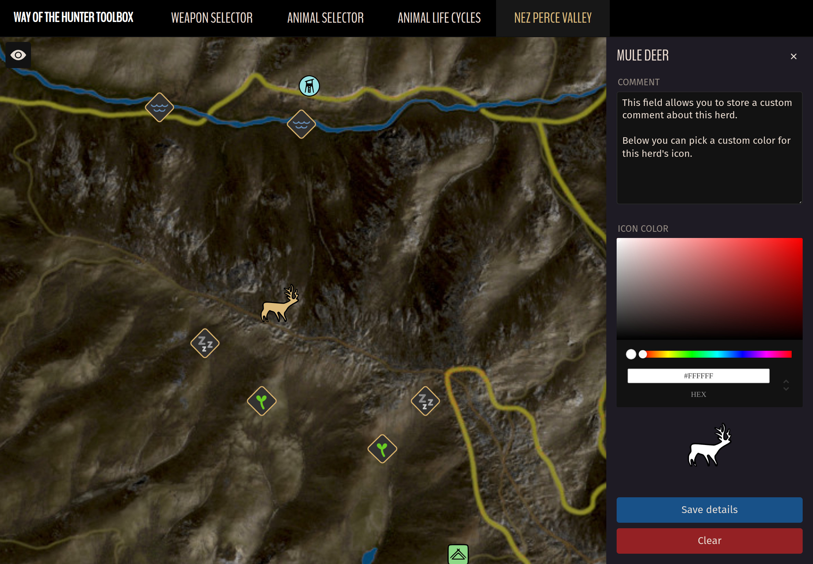
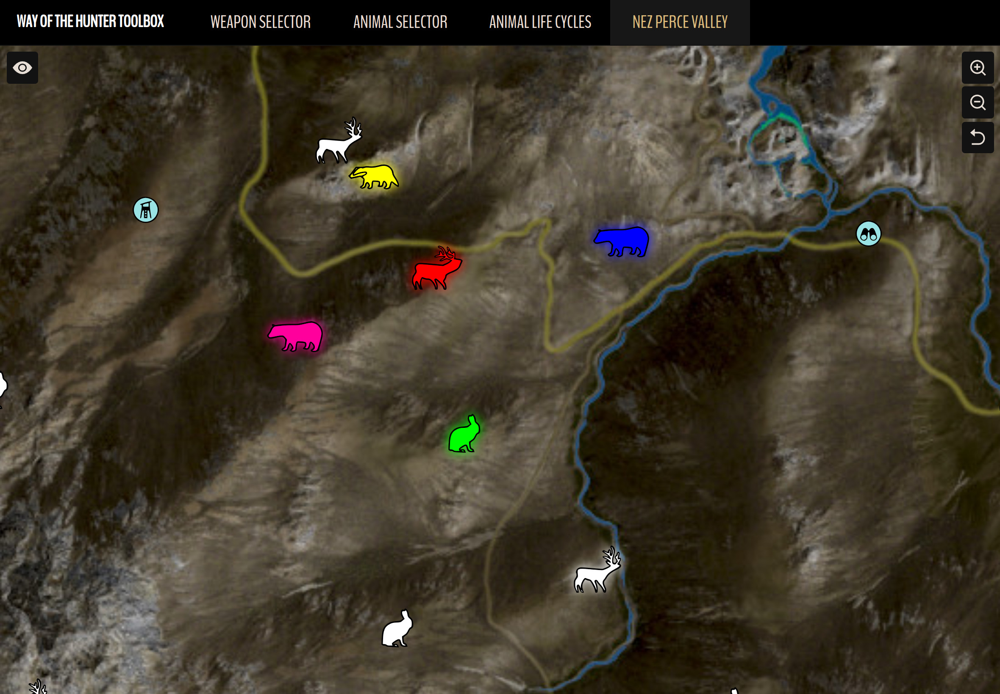

# Way Of The Hunter Toolbox

This interactive web application contains a suite of tools that can be used
while playing Way Of The Hunter. It allows you to:

- Choose the most appropriate weapons for each animal
- See which animals you can hunt with each individual weapon
- View activity times of all animals and birds (drinking, feeding and sleeping)
- Find locations of all animal herds and bird flocks as well as their need zones
  on Nez Perce Valley

Toolbox can be accessed by visiting https://codeaid.github.io/woth-toolbox/.

## Weapon Selector: Usage

To start choose an animal that you are planning to hunt from the sidebar on the
left. Once an animal is selected the right side of the page will be populated
with information about the animal such as its English and Latin names, a short
description, its tier and the recommended hit energy (RHE) in
[joules](https://steamcommunity.com/linkfilter/?url=https://en.wikipedia.org/wiki/Joule)
that should be used when hunting it.

Under this information you will find a table listing all available rifles and
their hit energy ratings at various distances in meters (50, 100, 150, 200 and
300).

_Refer to the instructions below on how to read values displayed in this table._

## Weapon Selector: Reading results

Values highlighted in **green** indicate the most optimal (ethical) hit energy
values for the currently selected animal at the respective distance.

Values highlighted in **orange** indicate hit energy values that fall within 10%
of the RHE range (i.e. values that are suboptimal but still mostly applicable to
the currently selected animal).

### How are suboptimal values calculated?

RHE range is the difference between the minimum RHE value and the maximum one.
E.g. for chamois the RHE is between 1,323 and 3,439 joules, which means that the
range is 2,116 joules (3,439 - 1,323 = 2,116).

10% of this value is 212 (due to rounding up or down to the nearest whole
number). That means that anything that is...

- between 1,111 (1,323 - 212) and 1,323
- OR
- between 3,439 and 3,651 (3,439 + 212)

...will be highlighted in orange and considered to be a suboptimal hit energy (
yet still acceptable).

All other values that are neither optimal nor suboptimal will be grayed out to
indicate that they are not ethical for the current animal at those distances.

_Names of weapons that are ethical at ALL listed distances will be highlighted
to make it easier to find them at a glance._

## Weapon Selector: Usage example

Let's take fallow deer as an example.

To find weapons that are the most ethical when hunting these animals up to 300
meters first select "Fallow Deer" from the sidebar on the left. Once done so,
you will see that the recommended hit energy values are between 1,462 and 3,510
joules:

Now let's look at the weapon results:

You will instantly notice that none of the weapons in tier 2 are applicable as
all their values are grayed out due to having insufficient hit energy at all
distances.

Steyr Scout in tier 3, however, is perfectly usable up to 150 meters, albeit the
values are rather close to the lower end of the RHE range. Values at 200 and 300
meters are just outside the recommended hit energy for fallow deer but should
still yield a successful harvest granted you land a hit on vital organs.

Going further down in the list you will see that Grandpa's Old Rifle is similar
in its hit energy to Steyr Scout but is slightly weaker and no longer optimal at
150 meters. Still usable at 0-100 meters though.

Now, tier 5, being the same tier as the animal itself (as displayed at the top
of the page), expectedly contains quite a few rifles that we can use. You can
see that four weapons are fully optimal at all ranges (Remington 783, Steyr
Monoblock, Steyr Pro Hunter and Steyr Pro Hunter II) and are perfect for hunting
fallow deer. Remington 1903 is a complete overkill up to 50 meters but is mostly
alright at 100 meters. Distances further than that are optimal.

Finally, as you can see none of the tier 6 weapons should be used for hunting
fallow deer as their hit energy values far exceed the recommended ones.
Remington 673 Guide Rifle could be used at 300 meters but is unethical at
anything less than that, which makes it a bad choice.

## Animal Selector

Animal selector page is identical in its logic to the Weapon Selector page,
except instead of seeing which weapons are applicable to each animal it shows
which animals you can hunt with each individual weapon.

## Animal Life Cycles

This page displays activity of every animal species on every hour of the day (
00-23). You can see when animals drink, feed or sleep thus making choosing need
zones that you should be targeting that much easier.

When hovering over individual life cycle activities (or alternatively tapping on
mobile devices) activities of all other species falling within the currently
selected hour will also be highlighted making it easy to see what other animals
are doing at that time.

## Nez Perce Valley map

This page displays an interactive map of Nez Perce Valley. Just like all the
other online maps you have used before it can be panned by dragging it with your
mouse or zoomed in and out by scrolling your mouse wheel up and down. It
currently does not support pinch-zooming on touch devices so please use the +/-
buttons available in the top right corner instead.

The map displays generic markers like lodges, shooting ranges, camps, hunting
stands, views and echoes as well as locations of all animal herds (or bird
flocks) and their need zones:

### Filtering

In order to be able to find animals you're looking for easier the map supports
showing or hiding individual marker types by using the filter. Simply click on
the "eye" icon in the top left of the page and click on filter rows to show or
hide markers of that type (when no filters are selected all markers are shown on
the map).

### Herd management

For those of you who like to keep track of individual herds - you can now do so!
The animal editor can be opened by _Shift_-clicking on an animal icon, which
will slide out a panel on the right side of the page. If you're on a
touch-enabled device like a tablet or phone simply long-press on the icon
instead (as there is no _Shift_ key):

In this panel you will be able to do two things - enter a custom comment in the
topmost text area as well as assign a custom color to the animal icon associated
with this herd. To pick a custom color first choose the hue by dragging your
mouse cursor over the colored bar and then drag your mouse around the larger
area above it.

Once you are happy with the changes click the _"Save details"_ button at the
bottom and the editor will automatically close. To open it again simply click on
the same animal icon on the map while holding your _Shift_ button.

To remove comments and custom colors from a herd open the animal editor and
click on the _"Clear"_ button. All data associated with this herd will be
deleted.

To close the animal editor without applying any changes simply click on the X
button in the top right.

As you can see from the screenshot below each herd can be colored individually:

### Where is animal data stored?

Any changes you make to the map are ONLY stored locally in the current
browser's [local storage](https://steamcommunity.com/linkfilter/?url=https://blog.logrocket.com/localstorage-javascript-complete-guide/)
as there is no server side to this application. That means that even if you
switch to a different browser none of the changes you made in the first browser
will be visible. Similarly, if you switch to another device (e.g. your laptop or
PC or tablet) you will not see any notes or custom colors if they were added on
a different device so keep that in mind when starting out mass documenting your
animal herds!

## Notes

This application was primarily designed to be used on desktop browsers. It is,
however, a responsive web application, which means that the layout and page
elements are dynamically adapted and resized to fit on all screens. As a result
the application also works perfectly well on tablets, which is my personal
choice when using it.

It is an open-source application so anyone willing to contribute new features is
more than welcome to do so on GitHub. Those that are more technically inclined
will know how to find the repository by just looking at the project URL.

Hope you enjoy using the application and please share your thoughts and ideas
below in the comments!
