This interactive web application contains a suite of tools that can be used
while playing [Way Of The Hunter](https://store.steampowered.com/app/1288320).

It allows you to:

- Choose the most appropriate weapons to hunt every animal in the game.
- See which animals you can hunt with each individual weapon.
- View life cycles of all animals and birds (drinking, feeding and sleeping times).
- Discover locations of all animals birds as well as their need zones on both
  in-game maps.

Maps feature official data supplied by [Nine Rocks Games](https://ninerocksgames.com)
and [THQ Nordic](https://www.thqnordic.com).

Toolbox can be accessed by visiting https://codeaid.github.io/woth-toolbox/.

## Animals: Usage

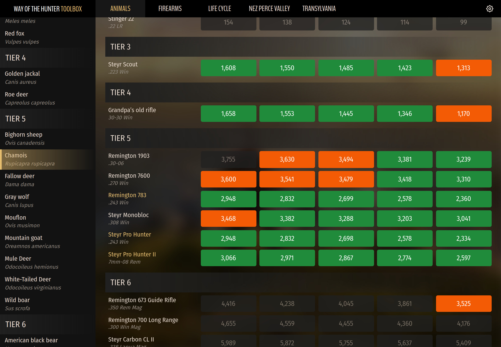

To start choose an animal that you are planning to hunt from the sidebar on the
left. Once an animal is selected the right side of the page will be populated
with information about the animal such as its English and Latin names, a short
description, its tier and the recommended hit energy (RHE)
in [joules](https://steamcommunity.com/linkfilter/?url=https://en.wikipedia.org/wiki/Joule)
that should be used when hunting it.

Under this information you will find a table listing all available weapons and
their hit energy ratings at various distances in meters (50, 100, 150, 200 and
300).

_Shotguns have no hit energy values associated with them and are only included
for the sake of having all in-game weapons listed._

## Animals: Reading results

Values highlighted in **green** indicate the most optimal (ethical) hit energy
values for the currently selected animal at the respective distance.

Values highlighted in **orange** indicate hit energy values that fall within 10%
of the RHE range (i.e. values that are suboptimal but still mostly applicable to
the currently selected animal).

### How are suboptimal values calculated?

RHE range is the difference between the minimum RHE value and the maximum one.
E.g. for chamois the RHE is between 1,323 and 3,439 joules, which means that the
range is 2,116 joules (3,439 - 1,323 = 2,116).

10% of this value is 212 (due to rounding up or down to the nearest whole
number). That means that anything that is...

- between 1,111 (1,323 - 212) and 1,323
- OR
- between 3,439 and 3,651 (3,439 + 212)

...will be highlighted in orange and considered to be a suboptimal hit energy (
yet still acceptable).

All other values that are neither optimal nor suboptimal will be grayed out to
indicate that they are not ethical for the current animal at those distances.

_Names of weapons that are ethical at ALL listed distances will be highlighted
to make it easier to find them at a glance._

## Animals: Usage example

Let's use fallow deer as an example.

To find weapons that are the most ethical when hunting these animals up to 300
meters first select "Fallow Deer" from the sidebar on the left. Once done so,
you will see that the recommended hit energy values are between 1,462 and 3,510
joules:

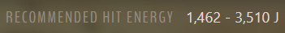

Now let's look at the weapon results:

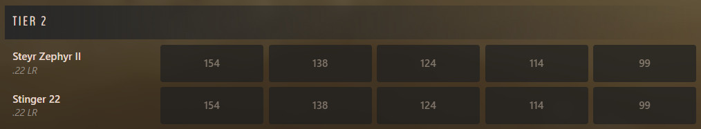

You will instantly notice that none of the weapons in tier 2 are applicable as
all their values are grayed out due to having insufficient hit energy at all
distances.

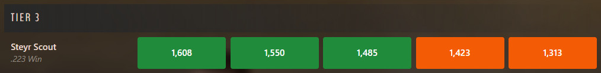

Steyr Scout in tier 3, however, is perfectly usable up to 150 meters, albeit the
values are rather close to the lower end of the RHE range. Values at 200 and 300
meters are just outside the recommended hit energy for fallow deer but should
still yield a successful harvest granted you land a hit on vital organs.

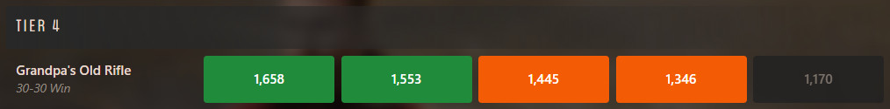

Going further down in the list you will see that Grandpa's Old Rifle is similar
in its hit energy to Steyr Scout but is slightly weaker and no longer optimal at
150 meters. Still usable at 0-100 meters though.

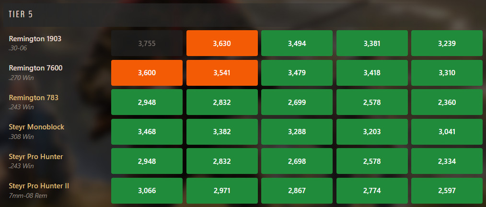

Now, tier 5, being the same tier as the animal itself (as displayed at the top
of the page), expectedly contains quite a few rifles that we can use. You can
see that four weapons are fully optimal at all ranges (Remington 783, Steyr
Monoblock, Steyr Pro Hunter and Steyr Pro Hunter II) and are perfect for hunting
fallow deer. Remington 1903 is a complete overkill up to 50 meters but is mostly
alright at 100 meters. Distances further than that are optimal.

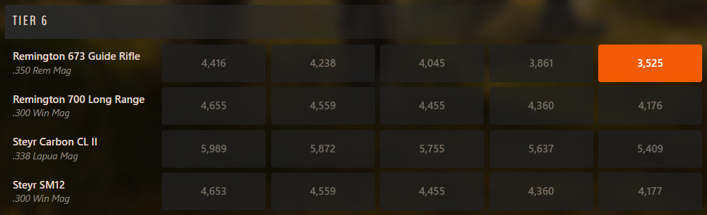

Finally, as you can see none of the tier 6 weapons should be used for hunting
fallow deer as their hit energy values far exceed the recommended ones.
Remington 673 Guide Rifle could be used at 300 meters but is unethical at
anything less than that, which makes it a bad choice.

## Firearms

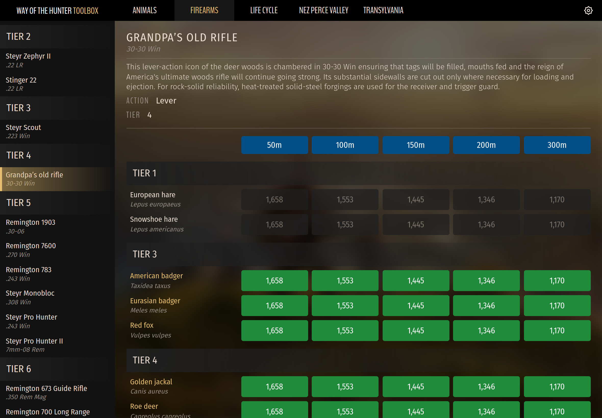

Firearms page is identical in its logic to the Animals page, except instead of
seeing which firearms are applicable to each animal it shows which animals you
can hunt with each individual firearm.

Likewise, energy rating symbolic remains the same as on the Animals page -
optimal hit energy values are highlighted in green, whilst suboptimal values are
highlighted in orange. Greyed out values mean that it is not ethical to use the
currently selected weapon for that animal at the indicated range.

## Life Cycle

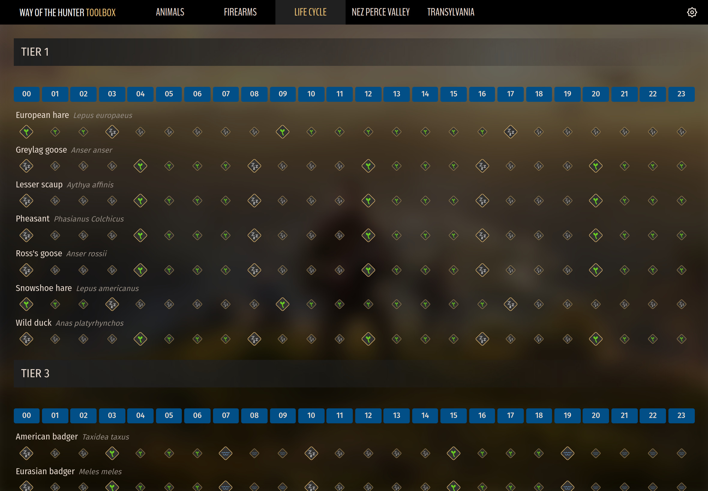

This page displays activity of every species at each hour of the day (00-23).
You can see when animals and birds drink, feed or sleep thus making targeting
correct need zones that much easier.

When hovering over individual life cycle activities (or alternatively tapping on
mobile devices) activities of all other species will also be highlighted at the
same hour making it easy to see what other animals are doing at the same time.

Additionally animals can be filtered by the map they are available on. To change
the target map simply click on one of the buttons at the top of the page.

## Maps

Just like all the other online maps you have used before maps can be panned by
dragging them with your mouse or zoomed in and out by scrolling your mouse wheel
up and down. They currently do not support pinch-zooming on touch devices so
please use the +/- buttons available in the top right corner instead.

Maps display generic markers like lodges, shooting ranges, camps, hunting
stands, views and echoes as well as locations and need zones of all animals and
birds.

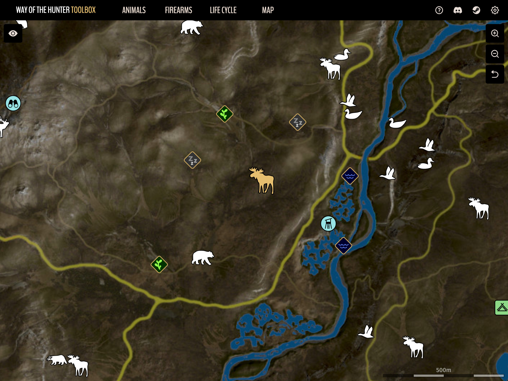

### Displaying need zones

To show all need zones of an animal (or bird) group simply click or tap on the
animal marker.

By default, when need zones of one animal are expanded zones of all other
animals are hidden to avoid cluttering the map with irrelevant information. To
override this behavior and expand multiple animal need zones at once hold Ctrl
button (or Cmd on MacOS) on your keyboard while clicking on markers:

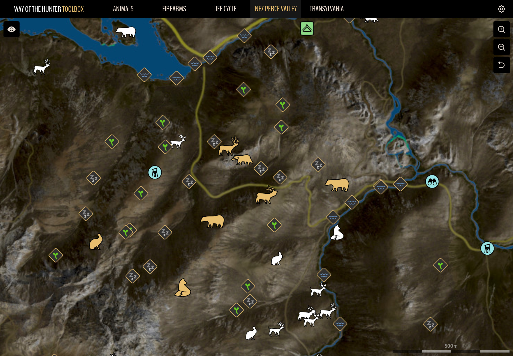

### Filtering

Maps support showing or hiding individual marker types to make it easier to find
animals you're looking for.

To access the filter simply click on the "eye" icon in the top left of the page.
Next, click on individual filter options to show or hide markers of that type (
when no filters are selected all markers are shown on the map). Alternatively
click on group headers (General or Animals) to toggle all markers in that group
on or off.

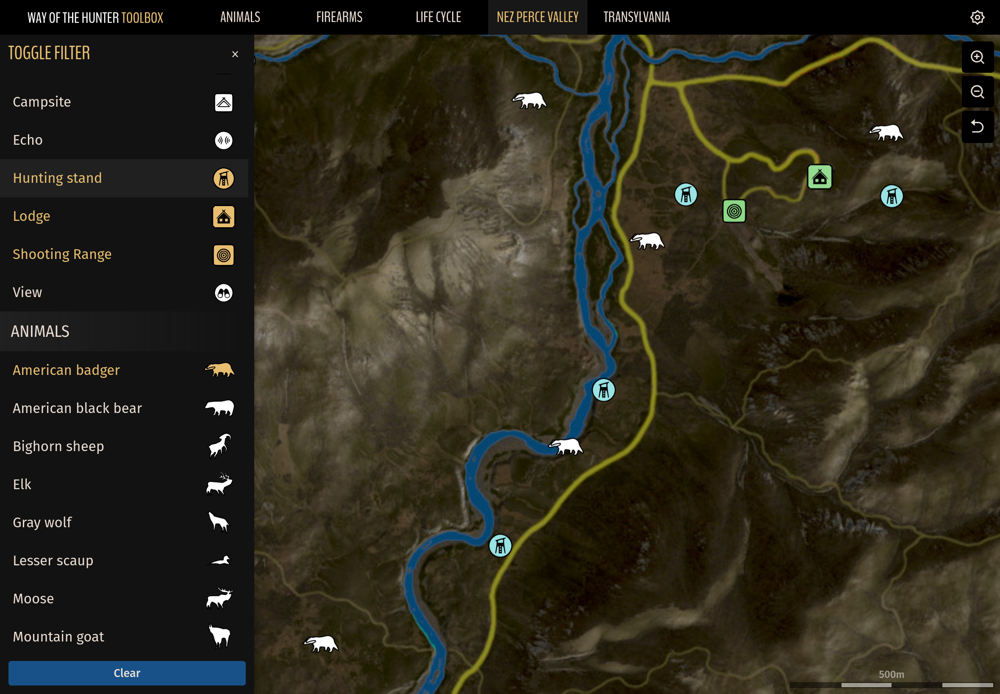

_Note: if only one type of markers is selected they will be visible even when
the map is fully zoomed out. This can be useful if you want to see all locations
of one specific animal at once without having to pan the map._

### Tracking and management

For those of you who like to keep track of individual herds - you can now do so!
The marker editor can be opened by Shift-clicking on an animal marker, after
which a panel will slide out from the right side of the page.

If you're on a touch-enabled device like tablet or phone simply press and hold
on the icon instead (as there is no Shift key available).

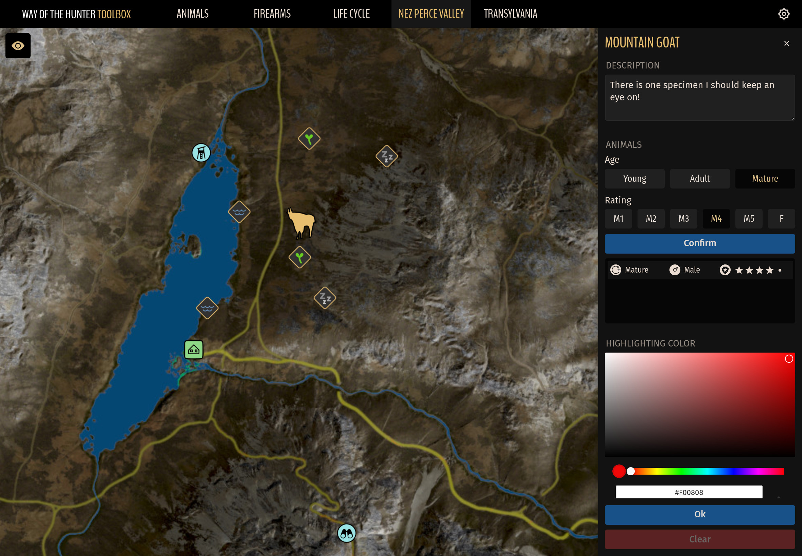

In this panel you will be able to do the following:

- Add custom comments
- Change marker's color
- Manage noteworthy specimens

**Choosing custom marker color**  
To pick a color first choose the desired hue by dragging your mouse cursor over
the colored bar above the color code and then drag your mouse around the larger
area above it to pick a specific tone.

**Managing specimens**  
This section allows you to build a list of noteworthy specimen for easier
tracking.

To add a new animal to the list first select its age by clicking on one of the
three buttons at the top (Young, Adult or Mature) followed by choosing its
trophy rating and sex from the row below. Buttons M1 to M5 denote 1-5 star
males, whilst F denotes females. Finish by clicking the "Confirm" button.

Animals in the list will first be sorted by sex, followed by their trophy
ratings. Females will be displayed at the end of the list whilst also sorted by
their age.

**Saving changes**  
Once you are done click the "Ok" button at the bottom of the panel to save your
changes and close the editor. To open it again simply click on the same animal
icon on the map while holding Shift.

To close the editor without applying any changes simply click on the X button in
the top right.

**Deleting marker data**  
To remove custom data from a marker open the editor and click on the "Clear"
button at the bottom of the panel.

As you can see from the screenshot below each herd can be colored individually:

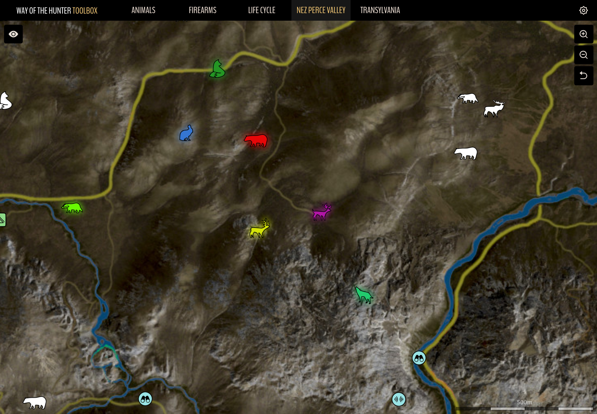

### Where is animal data stored?

Any changes you make to the map are ONLY stored locally in the current
browser's [local storage](https://steamcommunity.com/linkfilter/?url=https://blog.logrocket.com/localstorage-javascript-complete-guide/)
as there is no server side to this application. That means that even if you
switch to a different browser none of the changes you made in the first browser
will be visible. Similarly, if you switch to another device (e.g. your laptop or
PC or tablet) you will not see any notes or custom colors if they were added on
a different device so keep that in mind when starting out mass documenting your
animal herds!

## Settings

Application is available in the following languages:

- Chinese Simplified
- Chinese Traditional
- Czech
- English
- French
- German
- Hindi
- Indonesian
- Italian
- Japanese
- Polish
- Portuguese (Brazil) by Flyskin
- Russian
- Slovak
- Spanish
- Turkish

If your native language is in the list and you have configured it as the primary
language in your browser the application will automatically be displayed in said
language when you visit it. To choose a different language access the settings
by clicking on the cog icon in the top right corner of the page and change it by
selecting another language from the list in the panel that opens.

In this panel you will also be able to adjust marker sizes for all maps:

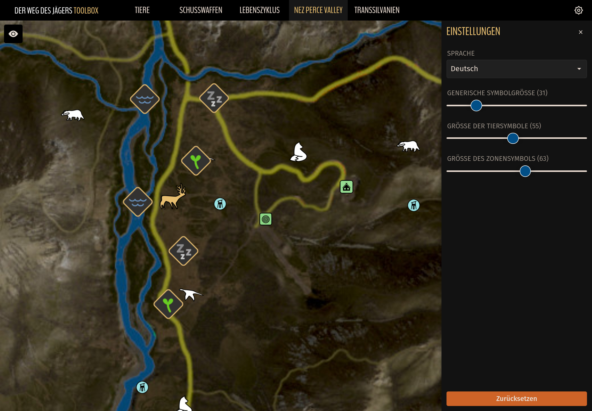

## Nez Perce Valley

Contains locations of all animals, birds as well as their need zones on the Nez
Perce Valley map. Please see the "Maps" section for more information on map
features and usage.

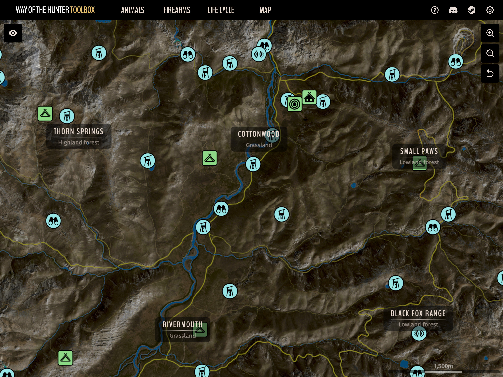

## Transylvania

Contains locations of all animals, birds as well as their need zones on the
Transylvania map. Please see the "Maps" section for more information on map
features and usage.

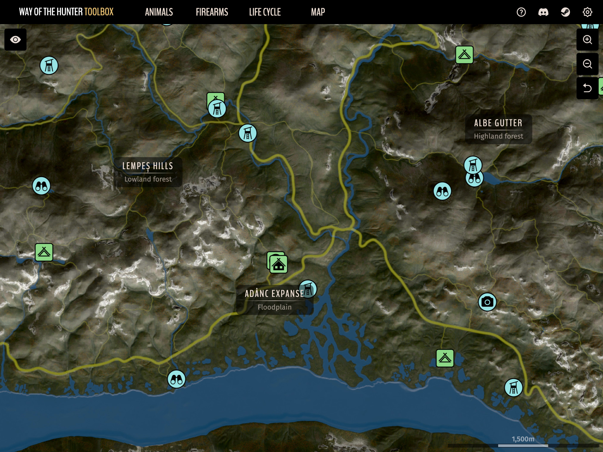

## Aurora Shores

Contains locations of all animals, birds as well as their need zones on the
Aurora Shores (Alaska) map. Please see the "Maps" section for more information on map
features and usage.

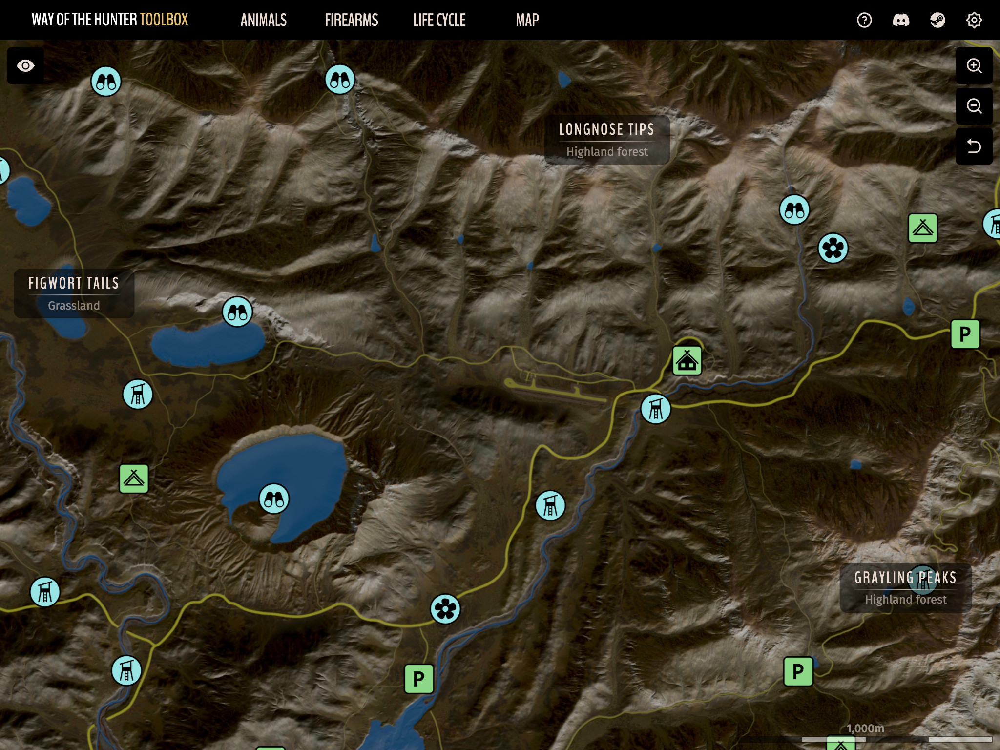

## Tikamoon Plains

Contains locations of all animals, birds as well as their need zones on the
Tikamoon Plains (Africa) map. Please see the "Maps" section for more information on map
features and usage.

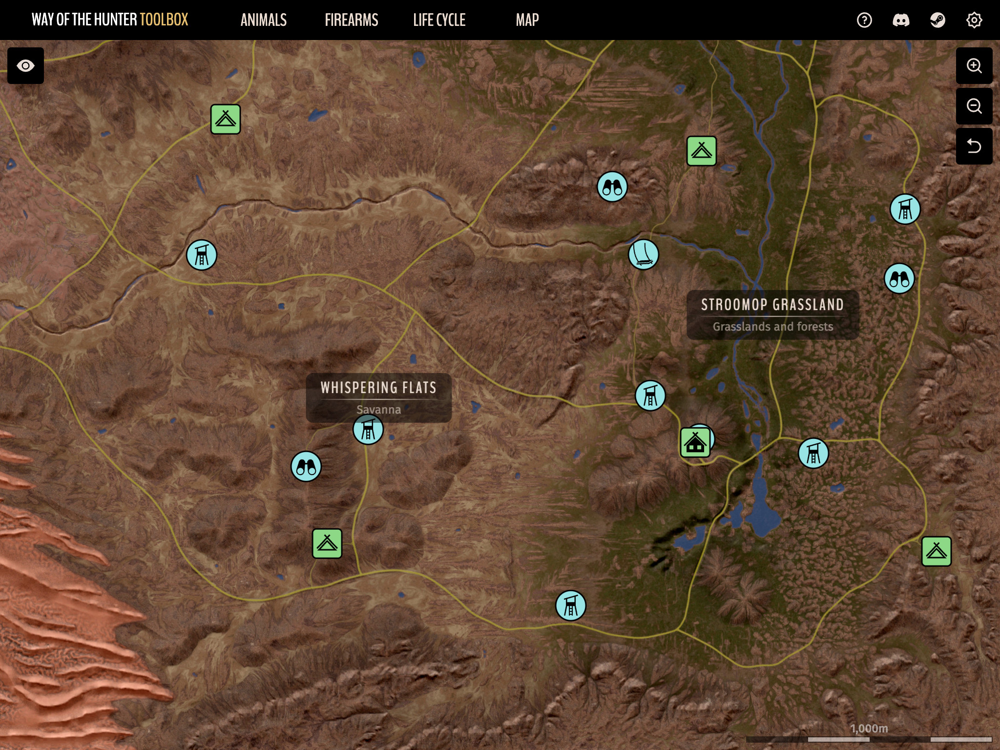

## Notes

This application was primarily designed to be used on desktop browsers, however,
it is a responsive web application, which means that the layout and page
elements are dynamically adjusted to fit on all screen sizes. As a result the
application also works perfectly well on tablets and mobile devices.

It is an open-source application so anyone willing to contribute new features is
more than welcome to do so
on [GitHub](https://steamcommunity.com/linkfilter/?url=https://github.com/codeaid/woth-toolbox).

Hope you enjoy using the application and please share your thoughts and ideas
[on Steam](https://steamcommunity.com/sharedfiles/filedetails/?id=2882064749)!

## Version History

Due to it growing in size application's version history has been moved to
project's wiki page and can be found here:

https://github.com/codeaid/woth-toolbox/wiki/Changelog
